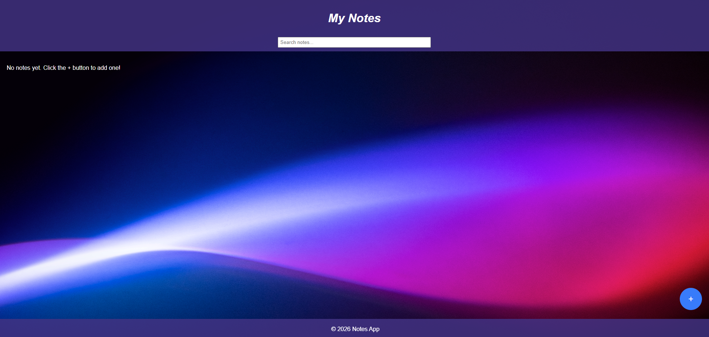
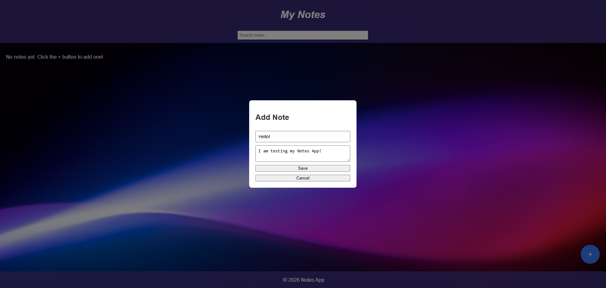
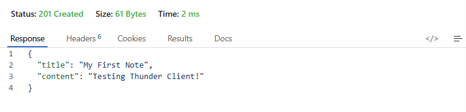

# 📝 Notes Taking App

## 📌 Description

A full-stack notes application that allows users to create, edit, and delete notes. This project is built with JavaScript, featuring a Node.js backend, an Express server, and MongoDB for persistent data storage. It demonstrates core concepts of full-stack development, including API design, database integration, and testing.

---

## ⚡ Quick Start

```
npm install
npm run dev
```

Then open: http://localhost:5000

---

## 🚀 Features

* Create, edit, and delete notes
* RESTful API built with Express
* Data persistence using MongoDB
* Server-side routing
* Unit and integration testing with Jest and Supertest
* Development workflow with Nodemon
* Persistent data storage using MongoDB Atlas

---

## 📸 Screenshots

### Main View


### Add Note Modal


---

## ✅ Status

✔ Backend API complete  
✔ MongoDB integration complete  
✔ CRUD functionality implemented  
🔄 Additional features in progress  

---

## 🧩 User Stories

### ✅ Implemented
- Create, edit, and delete notes
- View all notes
- Search notes

### 🔮 Planned
- Categorization
- Sync across devices
- User authentication

- As a user, I want to create a new note so I can capture my thoughts quickly.
- As a user, I want to edit existing notes so I can update or correct information.
- As a user, I want to delete notes so I can remove information that is no longer needed.
- As a user, I want to view all notes so I can easily find and access them.
- As a user, I want to search through my notes so I can quickly find specific information.
- As a user, I want to categorize my notes so I can organize them by topic or project.
- As a user, I want to sync my notes across devices so I can access them anywhere.
- As a user, I want to log in so my notes are private and secure.

---

## 🛠️ Technologies Used

### Frontend

* HTML5
* CSS3
* JavaScript

### Backend

* Node.js
* Express

### Database

* MongoDB
* Mongoose

### Testing

* Jest
* Supertest
* React Testing Library

### Tooling

* Babel
* Nodemon

---

## ⚙️ Installation

1. Clone the repository:

   ```
   git clone https://github.com/amandagm77/MiniProject_NotesApp.git
   ```

2. Navigate into the project directory:

   ```
   cd notes-app
   ```

3. Install dependencies:

   ```
   npm install
   ```

---

## ▶️ Running the Application

Start the server:

```
npm start
```

Run in development mode (auto-restart with Nodemon):

```
npm run dev
```

---

## 🧪 Running Tests

Run all tests:

```
npm test
```

---

## 📡 API Endpoints

| Method | Endpoint | Description |
|--------|--------|-------------|
| GET | /api/notes | Retrieve all notes |
| POST | /api/notes | Create a new note |
| PUT | /api/notes/:id | Update a note |
| DELETE | /api/notes/:id | Delete a note |

---

## 📸 API Testing

Tested API endpoints using Thunder Client in VS Code.



---

## 📂 Project Structure

Project structure highlighting key application components:

```
MiniProject_NotesApp/
│── assets/
│── public/
│    ├── index.html
│    ├── styles.css
│── server/
│    ├── server.js
│    ├── server.test.js
│    ├── models/
│── src/
│    ├── index.js
│    ├── components/
│── .babelrc
│── .env.example
│── jest.config.js
│── jest-setup.js
│── package.json
│── package-lock.json
│── README.md
```

---

## ⚙️ Environment Variables

Create a `.env` file in the root directory:
MONGO_URI=your_mongodb_connection_string
PORT=5000

---

## 🧠 What I Learned

* How to build a RESTful API using Express
* Connecting a Node.js application to MongoDB with Mongoose
* Writing unit and integration tests using Jest and Supertest
* Structuring a full-stack JavaScript application
* Managing development workflows with Nodemon

---

## 🔮 Future Improvements

* Add user authentication (login and signup)
* Deploy the application (e.g., Render, Vercel)
* Improve UI/UX design
* Add note categories or tags

---

## 👤 Author

Amanda McIntire

---

## 📄 License

This project was created as part of a software engineering bootcamp and is intended for educational and portfolio purposes.
